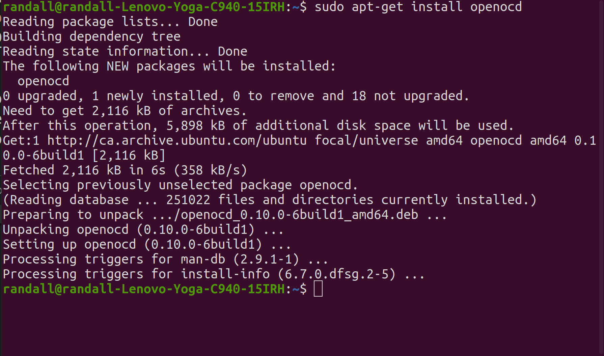
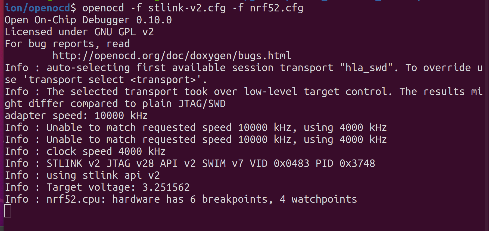
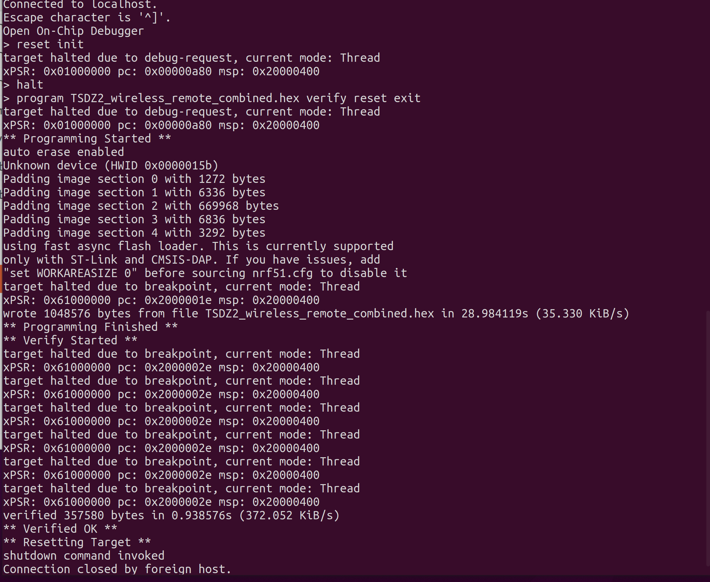

# Flashing with Ubuntu
1.    Open a terminal
2. Install OpenOCD (to connect to STLinkV2):
   
   Enter: __sudo apt-get install openocd__:

   
 
3. Connect the STLinkV2 to the board. For the  nRF52840 Nordic Dongle see the pinout below to connect to the SWDIO, SWDCLK, and GND pins, note that you do not need to connect the RST pin.
   
   

4. Note that you will also need to install the STLinkV2 udev rules file that are on the firmware/tools/ folder, so the STLinkV2 can be accessed by the OpenOCD:
    ```
    sudo cp 60-st_link_v2.rules /etc/udev/rules.d
    sudo udevadm control --reload-rules
    ```

5. From the terminal window, navigate to the openocd directory, and enter the following command to start the openocd server:
   
    ```
    $ openocd -f stlink-v2.cfg -f nrf52.cfg
    ```  
    

6. Start another terminal session to access the openocd server, and enter the following command:
    ```
    $ telnet localhost 4444
    $ reset init
    $ halt
    $ nrf5 mass_erase
    $ program (path to hex)/TSDZ2_bootloader_with_sd.hex verify
    $ reset exit 
    ```  

    

This will flash and verify the write.
If you see ** Verified OK **, the flashing has been successful.

Congratulations!
-------
* You now have the bootloader installed on the Nordic board.
* Future firmware upgrades can be done wirelessly.
* For more information on how to use the bootloader's Device Firmware Update (DFU) process to install a bootloader update or the remote control firmware or the wireless controller firmware, see [Understanding The Bootloader DFU Process](../documentation/dfu.md).

## [back](getting_started.md)
